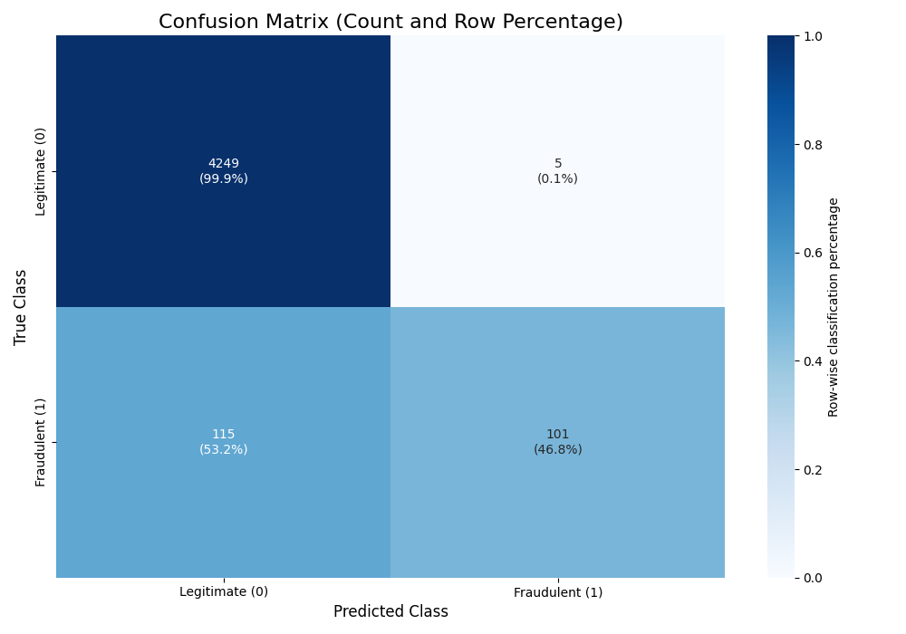

# Multinomial Naive Bayes for Fake Job Posting Detection

## Abstract
This repository contains an end-to-end implementation of a **Multinomial Naive Bayes (MNB)** classifier written from scratch in Python for binary text classification: detecting fraudulent job advertisements (`fraudulent = 1`) versus legitimate ads (`fraudulent = 0`). The pipeline integrates textual and categorical metadata, applies deterministic preprocessing, trains a probabilistic model with Laplace smoothing, and evaluates performance using a stratified hold-out protocol.

## 1. Problem Statement
Given a job posting document $d$, represented by textual content and encoded categorical attributes, the objective is to predict its class:
- $c = 0$: real (legitimate posting)
- $c = 1$: fake (fraudulent posting)

The task is framed as supervised binary classification.

## 2. Dataset
### 2.1 Original Source
Shivam Bansal (2020), *Real / Fake Job Posting Prediction* (Kaggle):  
https://www.kaggle.com/datasets/shivamb/real-or-fake-fake-jobposting-prediction

### 2.2 Local File Used
- `fake_job_postings.csv`

### 2.3 Target Variable
- `fraudulent`

## 3. Mathematical Formulation
The classifier implements the **Multinomial Naive Bayes MAP rule**.

### 3.1 Posterior and MAP Decision
For class $c \in \{0,1\}$ and document $d$:

$$
P(c \mid d) = \frac{P(d \mid c)P(c)}{P(d)}
$$

Since $P(d)$ is class-independent, prediction is:

$$
\hat{c} = \arg\max_{c} \; P(d \mid c)P(c)
$$

### 3.2 Multinomial Event Model
Let $V$ be the vocabulary and $n_w(d)$ the count of token $w$ in document $d$.
Under the Naive Bayes conditional independence assumption:

$$
P(d \mid c) \propto \prod_{w \in V} P(w \mid c)^{n_w(d)}
$$

Equivalently, up to a class-independent multinomial coefficient:

$$
P(d \mid c) = \frac{\left(\sum_{w \in V} n_w(d)\right)!}{\prod_{w \in V} n_w(d)!}
\prod_{w \in V} P(w \mid c)^{n_w(d)}
$$

### 3.3 Log-Linear Scoring Function Used in Code
To avoid underflow, the implementation scores each class in log-space:

$$
S(c,d) = \log P(c) + \sum_{w \in V \cap d} n_w(d)\log P(w \mid c)
$$

and predicts:

$$
\hat{c} = \arg\max_{c} S(c,d)
$$

The term $V \cap d$ reflects the actual code path: out-of-vocabulary tokens are ignored at inference.

### 3.4 Parameter Estimation with Laplace Smoothing
Define:
- $N$: number of training documents
- $N_c$: number of training documents in class $c$
- $N_{w,c}$: total count of token $w$ in class $c$
- $N_{\cdot,c} = \sum_{w \in V} N_{w,c}$: total token count in class $c$
- $|V|$: vocabulary size

Class prior:

$$
P(c) = \frac{N_c}{N}
$$

Smoothed class-conditional token probability:

$$
P(w \mid c) = \frac{N_{w,c} + \alpha}{N_{\cdot,c} + \alpha |V|}
$$

This project uses $\alpha = 1.0$.

### 3.5 Exact Score Formula Implemented
Substituting the estimates into the log-score yields:

$$
S(c,d) = \log\!\left(\frac{N_c}{N}\right) +
\sum_{w \in V \cap d} n_w(d)\,
\log\!\left(\frac{N_{w,c}+\alpha}{N_{\cdot,c}+\alpha|V|}\right)
$$

The predicted label is $\hat{c}=\arg\max_c S(c,d)$, exactly matching the `fit`/`predict` logic in `train_classifier.py`.

## 4. Feature Engineering and Preprocessing
The input representation is built from two groups of columns:

1. **Natural-text columns** (`TEXT_COLS`):
   title, location, department, salary range, company profile, description, requirements, benefits.
2. **Categorical columns** (`CAT_COLS`):
   telecommuting, has_company_logo, has_questions, employment_type, required_experience, required_education, industry, function.

Processing steps:
- missing text values -> empty string
- missing categorical values -> `__NA__`
- text normalization (`clean_natural_text`): lowercasing, digit masking, punctuation removal, stop-word filtering
- categorical encoding (`tokenize_categorical`): deterministic prefixed tokens, e.g. `TOKEN_INDUSTRY_IT`
- concatenation into a single feature string: `full_text`

## 5. Experimental Protocol
- Split strategy: `train_test_split`
- Test proportion: `0.25`
- Random seed: `42`
- Stratification: enabled (`stratify=y`)

The trained model is evaluated on the held-out test set.

## 6. Evaluation Outputs
Current script outputs:
- **Accuracy** (`accuracy_score`)
- **Confusion matrix** (normalized heatmap + raw counts) saved as:
  `confusion_matrix.png`

### Confusion Matrix (Example)


## 7. Reproducibility
### 7.1 Requirements
Python 3.9+ and:

```bash
pip install pandas numpy scikit-learn matplotlib seaborn
```

### 7.2 Run Command
From project root:

```bash
python train_classifier.py
```

## 8. Repository Structure
- `train_classifier.py` -> full training/evaluation pipeline
- `fake_job_postings.csv` -> dataset file expected by script
- `confusion_matrix.png` -> generated confusion matrix figure
- `document.tex` -> complete project report source (Romanian)
- `Documentatie Proiect Clasificator Bayes - Chiper Stefan.pdf` -> compiled report (Romanian)

## 9. Limitations and Extensions
### 9.1 Current Limitations
- single hold-out split (no cross-validation)
- no persisted model artifact (`pickle`/`joblib`)
- no CLI parameterization

### 9.2 Suggested Extensions
- k-fold cross-validation
- precision/recall/F1 and ROC-AUC reporting
- feature ablation studies (text-only vs text+categorical)
- baseline comparison against `sklearn.naive_bayes.MultinomialNB`

## References
1. Shivam Bansal (2020), *Real / Fake Job Posting Prediction* (Kaggle).  
   https://www.kaggle.com/datasets/shivamb/real-or-fake-fake-jobposting-prediction
2. Scikit-learn Developers, *Naive Bayes*.  
   https://scikit-learn.org/stable/modules/naive_bayes.html